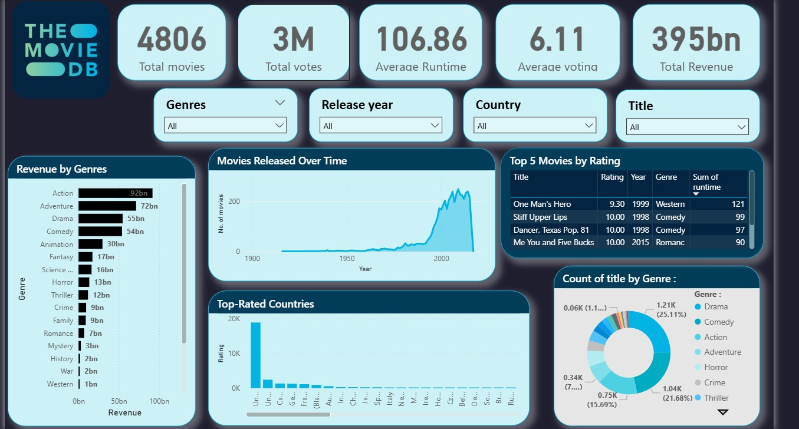

# 🎬 TMDB Movie Analytics Dashboard (Power BI)

An interactive movie dashboard built using Power BI, based on the TMDB dataset of over 5,000 movies. It helps analyze trends in revenue, ratings, popularity, genres, and more — all in a sleek, responsive layout.

---

## 🚀 Features

- 🧹 Cleaned messy genre & language JSON data
- 🔎 Searchable slicers (Genre, Country, Year, Title)
- 📊 KPIs (Total Movies, Avg Rating, Total Revenue, etc.)
- 📈 Combo chart: Revenue vs Vote Average
- 📉 Line & bar charts: Trends across genres and years
- 🎨 Custom theme + dynamic interactivity with filters

---

## 💻 Built With

- Power BI  
- Power Query  
- DAX  
- TMDB Dataset

---
## 🖼 Preview

## 📁 Dataset Source

[TMDB 5000 Movies Dataset on Kaggle](https://www.kaggle.com/datasets/tmdb/tmdb-movie-metadata)

---

## 📂 Files Included

- `MoviesDashboard.pbix` – Main Power BI file  
- `Dashboard.jpeg` – Preview image  
- `README.md` – Project documentation  

---

